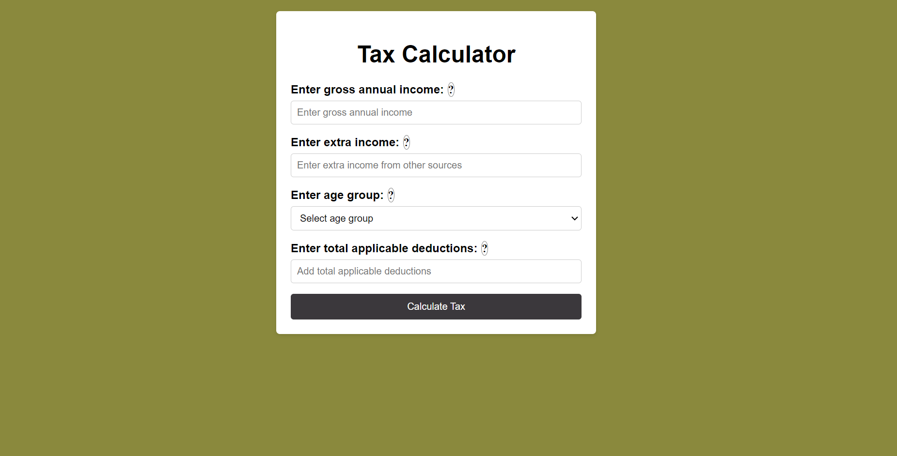

# TAX CALCULATOR



## Description

Tax Calculator is a web application that helps users calculate their income tax based on provided input such as gross annual income, extra income, age, and applicable deductions. The application applies specific tax rules and regulations to determine the tax amount owed by the user.

## Tech Stack

The Tax Calculator project is built using the following technologies:

- HTML
- CSS
- JavaScript

## How to Run Locally

To run the Tax Calculator project locally on your machine, follow these steps:

1. Clone the repository to your local machine using Git:

   ```bash
   git clone https://github.com/Raghujeet-singh/TaxCalculator.git
   ```

## Alternatively, you can use a local development server to run the project. If you have Node.js installed on your machine, you can use the following steps:

-Open a terminal or command prompt and navigate to the project directory.
-Run the following command to start a local development server: npx serve
-Once the server is running, you should see a message with the local URL (e.g., http://localhost:3000). Copy and paste this URL into your web browser to access the Tax Calculator application.

# All Test Cases with Screen Shots

\*\* Test Case 1 : If Gross Annual Income + Extra Income - Deductions = 6 Lakhs, no tax


\*\* Test Case 2 : if Gross Annual Income + Extra Income - Deductions = 9 Lakhs, tax


\*\* Test Case 3 : - Income over 8 (>) Lakhs, the amount over 8 Lakhs is taxed at - 30% for people with age < 40 - 40% for people with age ≥ 40 but < 60 - 10% for people with age ≥ 60 - Example - Age = 34, Income = 40 Lakhs, no deductions, tax = .3 \_ (40 - 8) = .3 \* 32 = 9.6 Lakhs

  


\*\* Other Test Cases: -

  


